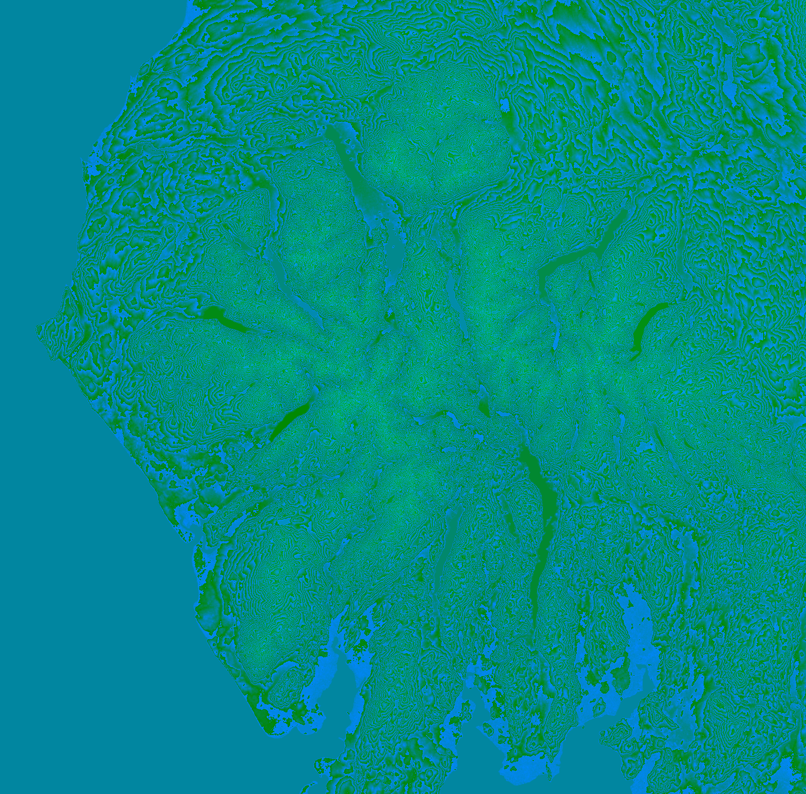

# HeightMapper: A python heightmap mesher to from raw data to .obj

This project takes Mapbox heightmap data and converts it into useable .obj files for 3D modelling. Its original intention was for the models to be used in a CAD/CAM software and machined on a CNC.

## Installation

Install required packages

    pip install -r requirements.txt

Copy env.example to .env and fill in mapbox API access key

    cp env.example .env

## Usage

Run mesher.py with the required parameters, --tl (top left coordinates), --br (bottom right coordinates), --zscale (scale factor for heightmap, default=1), --zoom (level of detail required (1-15, defualt=10)). Example:

    python mesher.py --tl 54.777073,-3.688893 --br 54.142366,-2.580539 --zscale 2 --zoom 10

*USAGE NOTE: Creating a mesh of a large area with high zoom will make a lot of API calls, which could breach the free limit of mapbox's API - the script will warn you of how many calls and confirm before running*

This will produce 2 files - result.png (a raw heightmap), and result.obj a 3D model of the heightmap

